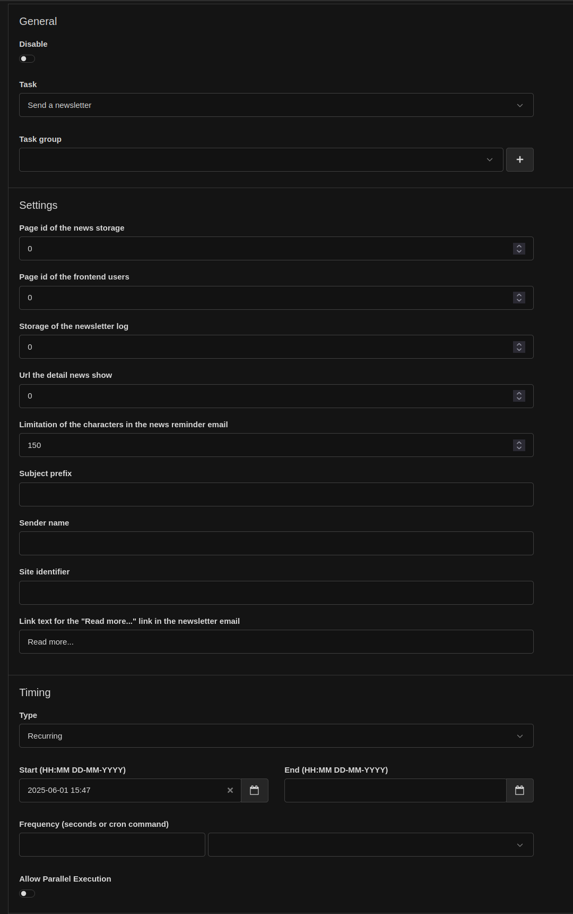
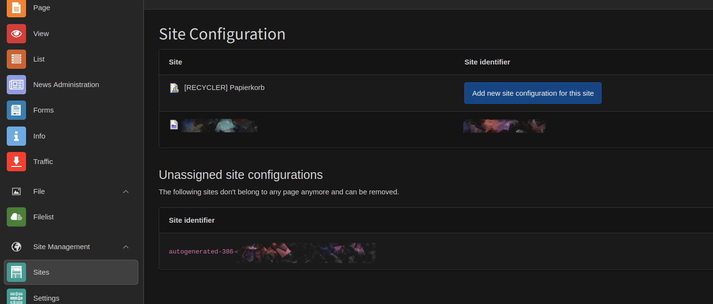
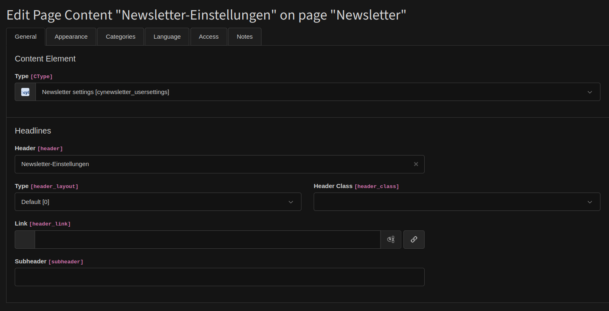
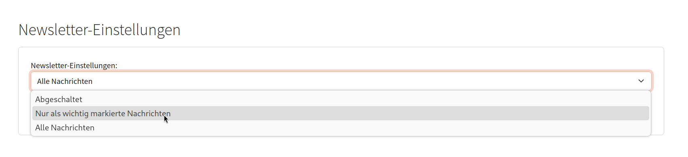
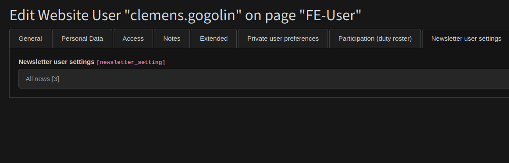

# TYPO3 Extension "cyNewsletter"

This extension monitors whether new news items have been created and sends an email to frontend users with the beginning of the news.

## Change-Log

* 3.1.0 :: UPD Update this README.md
* 3.0.3 :: FIX Frontend plugin throws an exception
* 3.0.2 :: FIX Add missing translation texts
* 3.0.1 :: UPD Update (clean) the TCA configuration
* 3.0.0 :: UPD to TYPO3 13.4.x
* 2.0.2 :: FIX The user flag “disable” was evaluated incorrectly. / The ununsed attribute t3ver_label generates exceptions.
* 2.0.1 :: FIX Disabled user does not receive a newsletter.
* 2.0.0 :: UPD to TYPO3 12.4.x
* 1.1.1 :: Fix the news url.
* 1.1.0 :: Fix the plugin configuration / registry.
* 1.0.6 :: Fix translation texts in the mail...
* 1.0.5 :: Allows the news extension 10.0.x
* 1.0.4 :: Add a space on the top of the save button / Removes unused files
* 1.0.3 :: Add typo script auto load
* 1.0.2 :: Fix the plugin descriptiom
* 1.0.1 :: Fix the broken log record icon / add a usertools migration wizzard
* 1.0.0 :: Initial

## Limitation

## Installation

### Background job for sending the newsletters.

**Note:** Please note the limitations of your hosting provider.

To set up, you need to create a task in the planner:

#### Benötigte Einstellungen: 

* **Page id of the news storage** : Enter the Page ID of the folder where the new news items should be created and monitored.
* **Page id of the frontend users** : Enter the Page ID of the folder where the frontend users are stored.
* **Storage of the newsletter log** : Create a folder to record which news items have already been sent as newsletters and provide its Page ID here.
* **Url the detail news show** : Enter the Page ID of the detail news page here.
* **Limitation of the characters in the news reminder email** : How many characters should be quoted from the news in the newsletter email at most?
* **Sender name** : What name should the sender of the newsletter have?
* **Site identifier** : Enter the site identifier here. See:
  
* **Link text for the "Read more..." link in the newsletter email** : Here you can specify an alternative text for "Read more"...

### Frontend User Option for Newsletter Dispatch

Die Erweiterung liefert eine FE-User-Erweiterung und FE-Plugin mit.

### Frontend plugin: 

**IMPORTANT** This plugin only makes sense for a page that is exclusively accessible to logged-in frontend users.

#### Frontend plugin for newsletter settings

This is how it looks in the frontend:

The user has three options:

* Newsletter disabled
* Newsletter only for important news
* Newsletter enabled

#### Backend frontend user

In the backend, you can check which settings the user has chosen. Changing these settings is not allowed and not intended.

